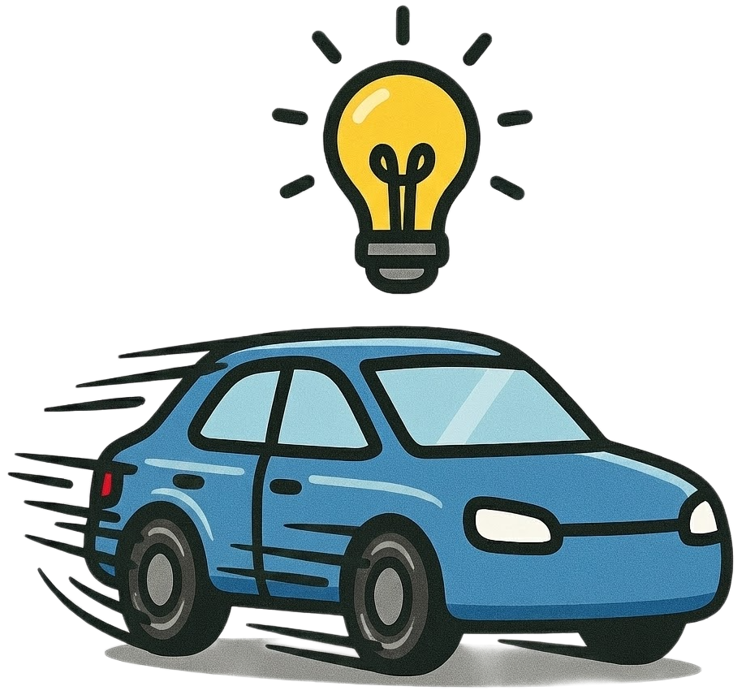
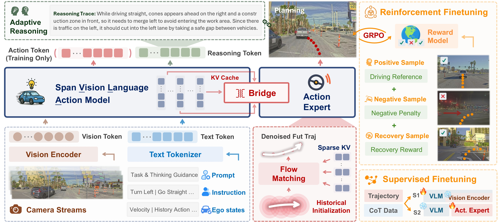

<div align="center">

#  SpanVLA 
<!-- <br> <span style="font-size: 0.5em; font-weight: normal;">A Vision-Language-Action Model for End-to-End Autonomous Driving with Adaptive Reasoning and Reinforcement Fine-Tuning</span> -->

[](https://spanvla.github.io/)
[](https://arxiv.org/abs/2604.19710)
[]()
[]()

</div

This is the official implementation of the paper:

**SpanVLA: Efficient Action Bridging and Learning from Negative-Recovery Samples for Vision-Language-Action Model**

[Zewei Zhou](https://zewei-zhou.github.io/)<sup>1,2*</sup>, [Ruining Yang](https://scholar.google.com/citations?user=qDBpexUAAAAJ&hl=en)<sup>2,3*</sup>, [Xuewei (Tony) Qi](https://scholar.google.com/citations?hl=en&user=pOA6uKMAAAAJ&view_op=list_works&sortby=pubdate)<sup>2†</sup>, [Yiluan Guo](https://scholar.google.com/citations?user=iQx57VIAAAAJ&hl=en)<sup>2</sup>, [Sherry X. Chen](https://sherryxtchen.github.io/)<sup>2</sup>, [Tao Feng]()<sup>2</sup>, [Kateryna Pistunova](https://scholar.google.com/citations?user=V7QY5j0AAAAJ&view_op=list_works&sortby=pubdate)<sup>2</sup>, [Yishan Shen](https://scholar.google.com/citations?user=Is58Ix8AAAAJ&hl=en/)<sup>2</sup>, [Lili Su](https://lilisu3.sites.northeastern.edu/)<sup>3</sup>, [Jiaqi Ma](https://mobility-lab.seas.ucla.edu/about/)<sup>1</sup>

<sup>1</sup> University of California, Los Angeles, USA | <sup>2</sup> Motional, USA  | <sup>3</sup> Northeastern University, USA

<sup>*</sup> Equal contribution. <sup>†</sup> Corresponding author.




SpanVLA introduce a efficient action bridging with sparse KV-Cache and history initialization and learn from negative-recovery samples to improve the robustness and performance.

## News
- **`2026/04`**: [SpanVLA](https://arxiv.org/abs/2604.19710) paper is now released.

<!-- ## Overview
- [Release Plan](#release-plan)
- [Dataset](#dataset)
- [Citation](#citation) -->

## Release Plan
- **`2026/04`**: ✅ SpanVLA paper.
- **`2026/09`**: SpanVLA codebase.
- **`2026/12`**: mReasoning dataset.


## Citation
If you find this repository useful for your research, please consider giving us a star 🌟 and citing our paper.
 ```bibtex
@article{zhou2026spanvla,
  author = {Zhou, Zewei and Yang, Ruining and Qi, Xuewei and Guo, Yiluan and Chen, Sherry X. and Feng, Tao and Pistunova, Kateryna and Shen, Yishan and Su, Lili and Ma, Jiaqi},
  title = {SpanVLA: Efficient Action Bridging and Learning from Negative-Recovery Samples for Vision-Language-Action Model},
  journal = {arXiv preprint arXiv:2604.19710},
  year = {2026},
}